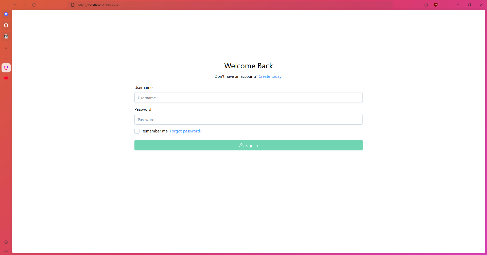
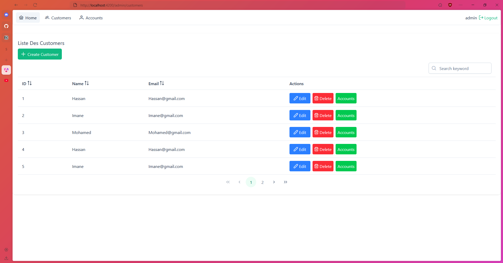
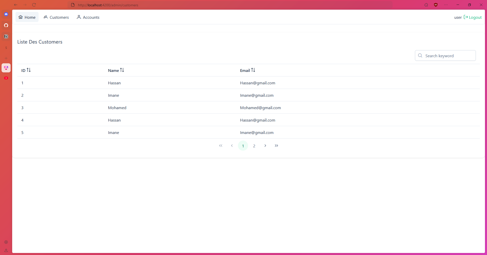
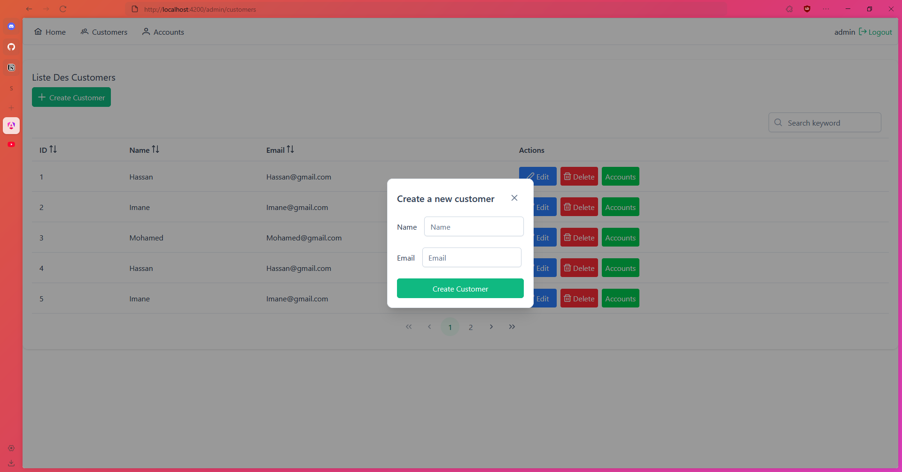
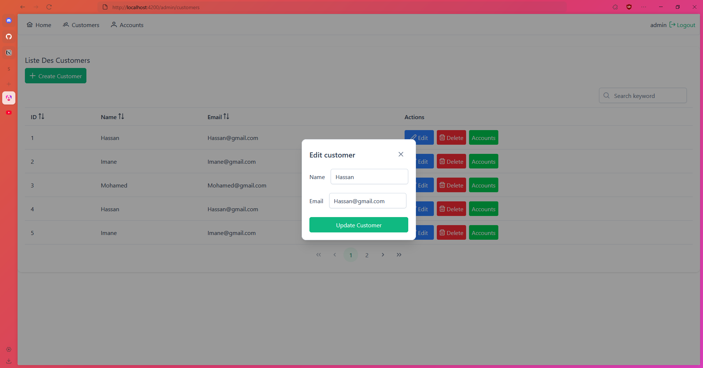
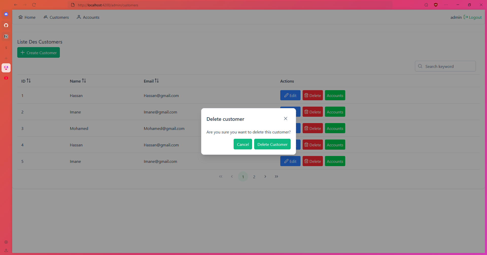
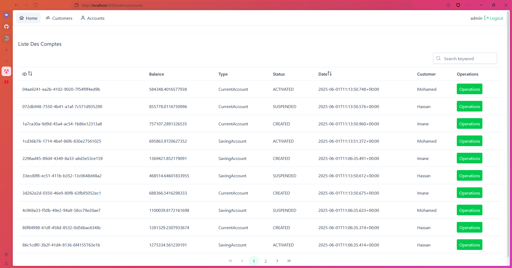
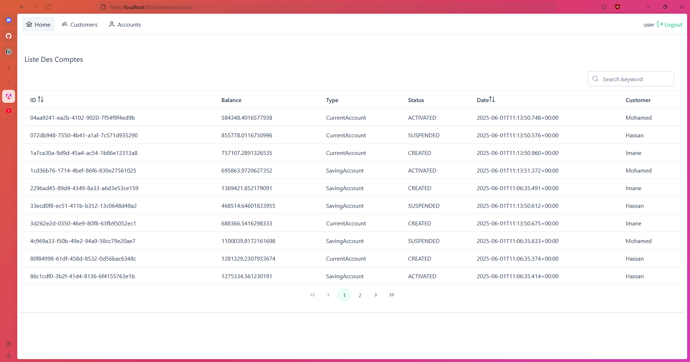
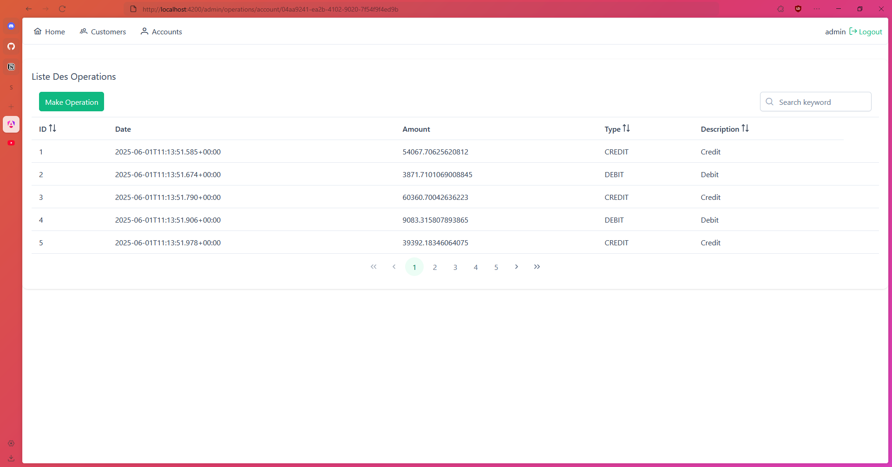
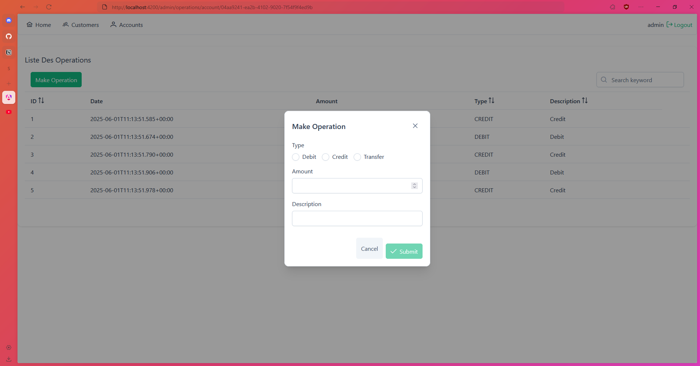

# Application de Banque Digitale
*Rapport Technique*

## Table des matières
- [Introduction](#introduction)
- [Architecture du Projet](#architecture-du-projet)
- [Technologies Utilisées](#technologies-utilisées)
- [Implémentation](#implémentation)
  - [Backend (Spring Boot)](#backend-spring-boot)
  - [Frontend (Angular)](#frontend-angular)
- [Fonctionnalités](#fonctionnalités)
- [Captures d'écran](#captures-décran)
- [Conclusion](#conclusion)

## Introduction
Ce rapport présente une application de banque digitale développée avec Spring Boot pour le backend et Angular pour le frontend. L'objectif principal est de fournir une solution complète pour la gestion des comptes bancaires, incluant la gestion des clients, des comptes et des transactions.

## Architecture du Projet
Le projet suit une architecture moderne basée sur les microservices, divisée en deux parties principales :

### Structure Backend
```plaintext
server/
├── src/
│   ├── main/
│   │   ├── java/
│   │   └── resources/
└── pom.xml
```

### Structure Frontend
```plaintext
client/
├── src/
│   ├── app/
│   ├── assets/
│   └── environments/
└── package.json
```

## Technologies Utilisées
- **Backend**: - Java 17, Spring Boot 3.4.5, Spring Data JPA, MySQL, Lombok, Swagger/OpenAPI
- **Frontend**: Angular, TypeScript, PrimeNG

## Implémentation
### Backend (Spring Boot)
Le backend est construit avec Spring Boot, un framework Java populaire pour le développement d'applications web. Il utilise Spring Data JPA pour la gestion des données et Lombok pour la génération de code

#### Modèle de Données
Le système utilise plusieurs entités principales :

##### DTO pour les opérations de crédit :

```java
@Data
public class CreditDTO {
    private String accountId;
    private double amount;
    private String description;
}
```

##### Interface Account :

```typescript
export interface Account {
  id: string;
  balance: number;
  createdAt: Date;
  status: AccountStatus;
  type: string,
  customer: Customer,
}
```

### Frontend (Angular)
Le frontend est développé avec Angular, un framework JavaScript pour la création d'applications web modernes. Il utilise PrimeNG pour les composants d'interface utilisateur.

#### Login 
```html
<div class="surface-card p-4 shadow-2 border-round mt-[10%] w-[50%] m-auto">
  <div class="text-center mb-5">
    <div class="text-900 text-3xl font-medium mb-3">Welcome Back</div>
    <!-- ... autres éléments ... -->
  </div>
  <form [formGroup]="formLogin" (ngSubmit)="onSubmit()">
    <!-- ... formulaire de connexion ... -->
  </form>
</div>
```

#### Composant de Liste des Comptes
```html
<p-card header="Liste Des Comptes" [style]="{'width': '100%'}">
  <p-table #dt [value]="accounts" [paginator]="true" [rows]="10">
    <!-- ... configuration du tableau ... -->
  </p-table>
</p-card>
```

## Fonctionnalités

### API REST

## user0220483523
Copy

Delete

Objective:

Generate a professional French report in a file named report.md. This report will be submitted to my professor, so the tone should be formal and well-structured.

Report Structure Requirements:

Title

A clear and concise title related to the content of the report.

Introduction

A brief descriptive introduction explaining the context and purpose of the project/code.

Table of Contents

Automatically link to each main section of the document.

Main Body: Code Explanation

The entire code must be explained section by section.

For each part:

Include the relevant code block.

Provide a detailed explanation of its function and logic.

Repeat this process until the entire code is covered.

Integration of Screenshots

For each image in the screenshots folder:

Insert the image into the report.

Add a caption/description explaining what the image illustrates in the context of the project.

Conclusion

Summarize the key points of the project.

Reflect on what was accomplished and any challenges encountered. Workspace screenshots client server

## Trae AI
25 context(s) used

Workspace

README.md 24-26

README.md 26-34

index.html 2-16

.editorconfig 2-20

CreditDTO.java 2-12

... More ( 19 +)

I'll help you create a professional French report based on the Digital Banking project. I'll generate the content for report.md .

```markdown
# Application de Banque Digitale
*Rapport Technique*

## Table des matières
- [Introduction](#introduction)
- [Architecture du Projet](#architecture-du-projet)
- [Technologies Utilisées](#technologies-utilisées)
- [Implémentation](#implémentation)
  - [Backend (Spring Boot)](#backend-spring-boot)
  - [Frontend (Angular)](#frontend-angular)
- [Fonctionnalités](#fonctionnalités)
- [Captures d'écran](#captures-décran)
- [Conclusion](#conclusion)

## Introduction
Ce rapport présente une application de banque digitale développée avec Spring Boot pour le backend et Angular pour le frontend. L'objectif principal est de fournir une solution complète pour la gestion des comptes bancaires, incluant la gestion des clients, des comptes et des transactions.

## Architecture du Projet
Le projet suit une architecture moderne basée sur les microservices, divisée en deux parties principales :

### Structure Backend
```plaintext
server/
├── src/
│   ├── main/
│   │   ├── java/
│   │   └── resources/
└── pom.xml
 ```
```

### Structure Frontend
```plaintext
client/
├── src/
│   ├── app/
│   ├── assets/
│   └── environments/
└── package.json
 ```

## Technologies Utilisées
### Backend
- Java 17
- Spring Boot 3.4.5
- Spring Data JPA
- MySQL
- Lombok
- Swagger/OpenAPI
### Frontend
- Angular
- PrimeNG
- TypeScript
- HTML/CSS
## Implémentation
### Backend (Spring Boot) Modèle de données
Le système utilise plusieurs entités principales :

DTO pour les opérations de crédit :

```java
@Data
public class CreditDTO {
    private String accountId;
    private double amount;
    private String description;
}
 ```

Interface Account :

```typescript
export interface Account {
  id: string;
  balance: number;
  createdAt: Date;
  status: AccountStatus;
  type: string,
  customer: Customer,
}
 ```

### Frontend (Angular) Composant de Login
```html
<div class="surface-card p-4 shadow-2 border-round mt-[10%] w-[50%] m-auto">
  <div class="text-center mb-5">
    <div class="text-900 text-3xl font-medium mb-3">Welcome Back</div>
    <!-- ... autres éléments ... -->
  </div>
  <form [formGroup]="formLogin" (ngSubmit)="onSubmit()">
    <!-- ... formulaire de connexion ... -->
  </form>
</div>
 ```
```
 Composant des Comptes
```html
<p-card header="Liste Des Comptes" [style]="{'width': '100%'}">
  <p-table #dt [value]="accounts" [paginator]="true" [rows]="10">
    <!-- ... configuration du tableau ... -->
  </p-table>
</p-card>
```

## Fonctionnalités
### API REST
L'application expose plusieurs endpoints REST :

#### Gestion des Clients
- GET /customers - Liste des clients
- POST /customers - Création d'un client
- PUT /customers/{customerId} - Mise à jour d'un client
- DELETE /customers/{id} - Suppression d'un client

#### Gestion des Comptes
- GET /accounts - Liste des comptes
- GET /accounts/{accountId} - Détails d'un compte

#### Gestion des Transactions
- GET /accounts/{accountId}/operations - Historique des transactions
- GET /accounts/{accountId}/pageOperations - Transactions paginées

## Captures d'écran

### Page de Connexion
Interface de connexion permettant aux utilisateurs de s'authentifier avec leurs identifiants.


### Gestion des Clients 

#### Liste des Clients (Vue Administrateur)
Vue administrateur de la liste des clients avec les boutons d'ajout, de modification et de suppression.

#### Liste des Clients (Vue Utilisateur)
Vue utilisateur de la liste des clients sans les options de modification.

#### Dialogue d'Ajout de Client
Formulaire permettant d'ajouter un nouveau client avec ses informations personnelles.

#### Dialogue de Modification de Client
Interface de modification des informations d'un client existant.

#### Dialogue de Suppression de Client
Confirmation de suppression d'un client.


### Gestion des Comptes 
#### Liste des Comptes (Vue Administrateur)
Vue administrateur des comptes avec accès aux opérations.

#### Liste des Comptes (Vue Utilisateur)
Vue utilisateur des comptes avec fonctionnalités limitées.



### Opérations 
#### Liste des Opérations
Historique détaillé des opérations effectuées sur un compte.

#### Dialogue d'Opération
Interface permettant d'effectuer une nouvelle opération sur un compte (débit, crédit, virement).

  
## Conclusion

Ce projet de banque digitale représente une solution moderne et robuste pour la gestion bancaire, combinant les technologies Spring Boot et Angular pour offrir une expérience utilisateur optimale. Les points clés de cette réalisation sont :

### Aspects Techniques
- Une architecture microservices bien structurée
- Une séparation claire entre le backend (Spring Boot) et le frontend (Angular)
- Une gestion efficace des données avec Spring Data JPA
- Une interface utilisateur réactive et moderne avec Angular et PrimeNG

### Fonctionnalités Principales
- Gestion complète des clients (création, modification, suppression)
- Gestion des comptes bancaires
- Système d'opérations bancaires (débits, crédits, virements)
- Interface différenciée selon les rôles (administrateur/utilisateur)

### Sécurité et Performance
- Système d'authentification robuste
- Gestion des rôles et des permissions
- Interface responsive et intuitive

Ce projet démontre la capacité à concevoir et implémenter une solution bancaire digitale complète, répondant aux exigences modernes de sécurité et d'expérience utilisateur. Les choix technologiques effectués permettent une maintenance aisée et des évolutions futures facilitées.

Les perspectives d'évolution pourraient inclure :
- L'ajout de fonctionnalités avancées de reporting
- L'intégration de services bancaires supplémentaires
- L'optimisation des performances pour une montée en charge
- L'ajout de fonctionnalités mobiles natives

En conclusion, cette application constitue une base solide pour un système bancaire digital moderne, alliant sécurité, performance et facilité d'utilisation.
